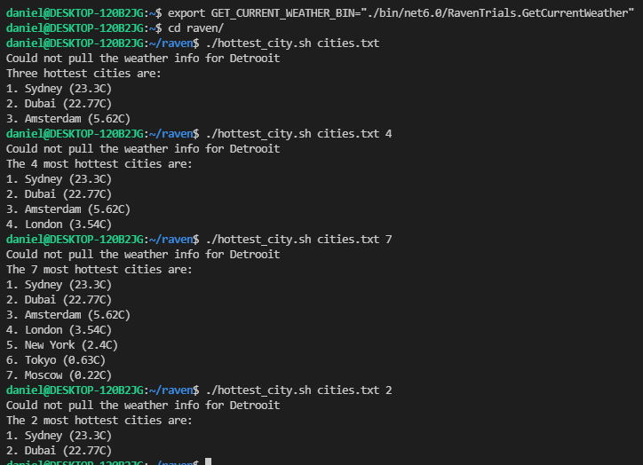

# Get The K most hottest cities
## Task for job interview

The task receive cities list and pull there data from API, then shows the K most hottest cities

## Features

- Get data from API made in parallel
- You can choose the number of most hottest cities to show(Default=3)

## Running The Script

In the first time you need to set the environment variable GET_CURRENT_WEATHER_BIN

```sh
export GET_CURRENT_WEATHER_BIN="./bin/net6.0/RavenTrials.GetCurrentWeather"
```

After setting the variable you need to enter to the directory

```sh
cd raven/
```

Then you can run the script

```sh
./hottest_city.sh cities.txt [k-optional]
```
* k-optional - numeric number, show the k most hottest cities
  ```sh
  ./hottest_city.sh cities.txt 5
  ```
  
## Screenshots



